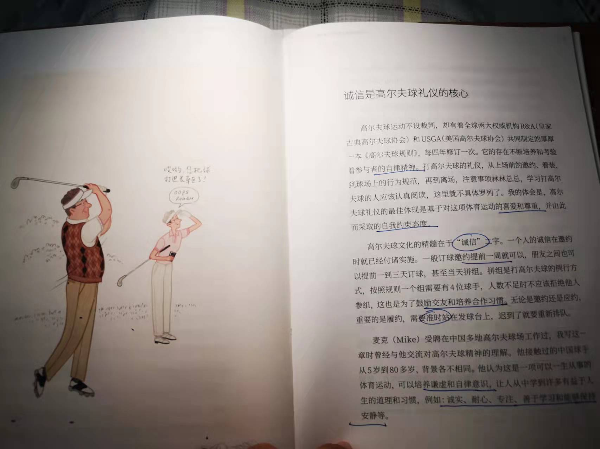

# 引言

这本书是冬奥会志愿者培训时，傅莹大师的陪同工作人员，清华大学国际处的肖茜老师送给我的。之前从来没有对礼仪方面有过了解，这是第一次。很好奇这本书。

# 结语

这本书读的过程中，我经历了很多坎坎坷坷，因此读的进度也很缓慢。仅仅是在读完之后做一点简要的陈述。

在这本书里，表面上可以学到一些礼仪知识，例如着装、吃饭等等，再往下可以学到一些和人打交道的技巧，例如如何通过打高尔夫球解决外交问题。但其实最本质的，还是如何与人相处，尊重是第一要义，彼此舒服是非常重要的。不被察觉的柔和的关心，是最为高级的。

直接附上一节对高尔夫球的讲述

